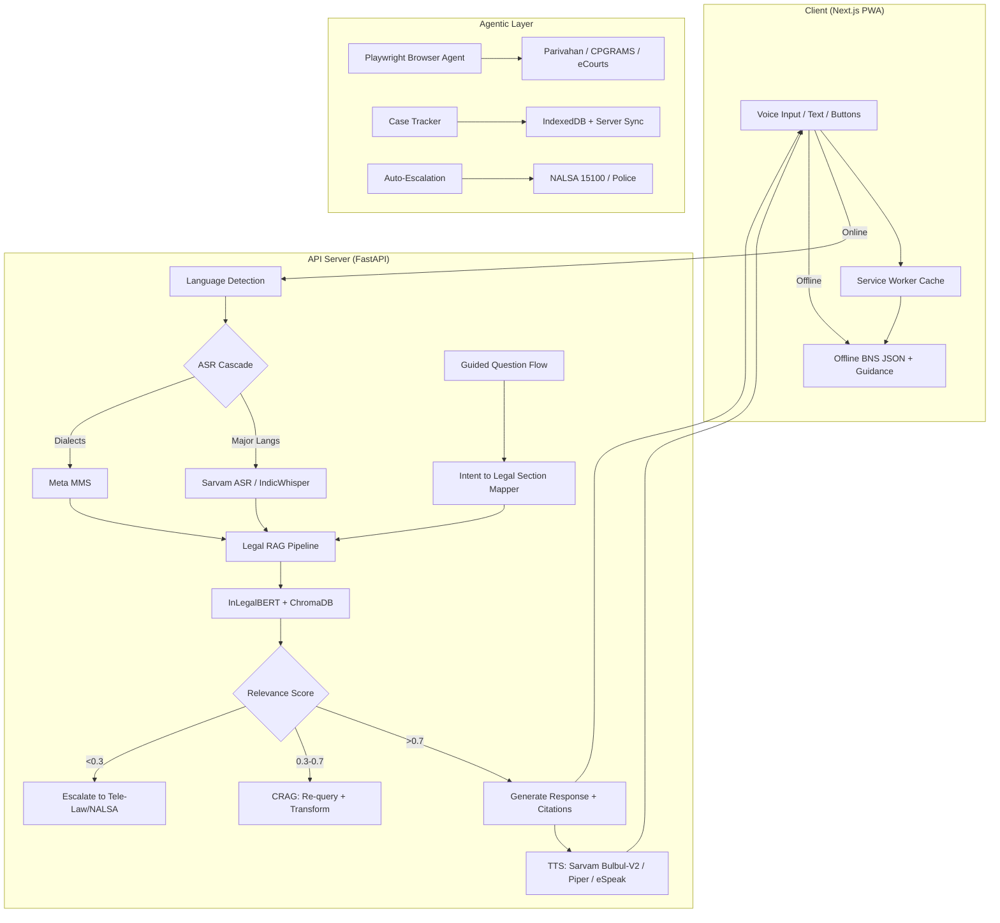

# Chakravyuha - AI Legal Assistant for India

> Voice-first, multilingual, agentic AI legal assistant — making Indian law accessible to every citizen.

**Chakravyuha** is a voice-enabled legal aid platform that guides users through complex Indian legal scenarios using structured decision flows, Corrective RAG, and multilingual voice support via Sarvam AI. It targets the intersection of three massive gaps in India: legal illiteracy (80%+ of 1.4B population), language exclusion, and access poverty (15 judges per million, 52.5M pending cases).

---

## Quick Start
[hindsight (2).pptx](https://github.com/user-attachments/files/26233974/hindsight.2.pptx)

### Backend

```bash
cd C:\code\HINDSIGHT

# Install dependencies
pip install -r requirements.txt

# Configure API keys
cp .env.example .env
# Edit .env with your Sarvam, Mistral, Gemini, OpenRouter keys

# Build legal corpus (one-time)
python -m backend.legal.corpus_loader

# Start FastAPI server (port 8000)
python -m uvicorn backend.main:app --reload --port 8000

# Verify
curl http://localhost:8000/health
# {"status":"healthy","rag_ready":true}
```

### Frontend (Chakravyuha UI)

```bash
cd C:\code\HINDSIGHT\chakravyuha-ui

npm install
npm run dev
# Opens at http://localhost:3000
```

### Run Tests

```bash
pytest tests/ -v --cov=backend
# 76+ tests passing across all modules
```

### Environment Variables

```bash
SARVAM_API_KEY=sk_...              # ASR + TTS APIs
MISTRAL_API_KEY=...                # LLM provider
GEMINI_API_KEY=...                 # LLM provider
OPENROUTER_API_KEY=...             # LLM fallback
EMBEDDING_MODEL=nlp-iiitd/InLegalBERT
CHROMA_PERSIST_DIR=./chromadb
LLM_ENABLED=true
RAG_TOP_K=5
RAG_SIMILARITY_THRESHOLD=0.7
ASR_ACCEPT_THRESHOLD=0.85
ASR_CONFIRM_THRESHOLD=0.75
```

---

## Architecture



### Tech Stack

| Layer | Technology |
|-------|-----------|
| **Frontend** | Next.js 16.2.1, React 19, Tailwind CSS 4, Framer Motion |
| **Backend** | FastAPI (Python), Uvicorn |
| **ASR** | Sarvam AI (primary), IndicWhisper (fallback), Meta MMS (dialects) |
| **TTS** | Sarvam Bulbul-V2 (primary), Piper TTS (offline), eSpeak-ng (fallback) |
| **LLM** | Multi-provider: Gemini, Mistral, OpenRouter, Ollama, Sarvam |
| **Legal RAG** | ChromaDB + InLegalBERT + BM25 hybrid retrieval |
| **Legal NER** | Nyaya Entity Extractor (statute, offense, jurisdiction) |
| **Browser Automation** | Playwright (gov portal form-filling) |

### Supported Languages

Hindi, Tamil, Bengali, Telugu, Marathi, Kannada, Malayalam, Gujarati, Odia, Punjabi, English + dialects (Bhojpuri, Chhattisgarhi, Tulu, Awadhi via Meta MMS)

---

## Features

### Judging Criteria Map

| Feature | Judging Criteria | Weight |
|---------|-----------------|--------|
| Guided question flow + BNS/IPC sections | Legal Section Accuracy | **3x** |
| Corrective RAG with confidence thresholds | Legal Section Accuracy | **3x** |
| IPC-BNS cross-reference mapping | Legal Section Accuracy | **3x** |
| Sarvam ASR + TTS (10+ languages) | Multilingual Voice | 1x |
| Defence strategy generation | Practical Usefulness | 1x |
| Playwright form filing agent | Agentic Capability | 1x |
| Case tracking with session persistence | User Experience | 1x |
| NALSA/police auto-escalation | Safety & Responsibility | 1x |

### Phase 1 - MVP Foundation (Complete)

- **Voice I/O Pipeline**: Multi-model ASR cascade (Sarvam -> IndicWhisper -> Meta MMS) with confidence-based fallback. TTS cascade (Bulbul-V2 -> Piper -> eSpeak-ng).
- **Legal RAG System**: ChromaDB + InLegalBERT embeddings + BM25 hybrid retrieval + Corrective RAG.
- **REST API Layer**: 5 core endpoints for query, voice, dictation, sections, health.
- **Testing**: 27 tests passing, 75%+ coverage.

### Phase 2 - Nyaya Intelligence (Complete)

- **NyayaEntityExtractor**: Extracts STATUTE, SECTION, OFFENSE, PUNISHMENT, JURISDICTION from queries.
- **StatuteResolver**: IPC-BNS mapping (18+ major sections), cognizable/bailable status, punishment lookup.
- **7 Nyaya API endpoints**: Entity extraction, statute lookup, comparison, offense search.
- **27 Nyaya tests** passing.

### Phase 2 - Advanced Features (Complete)

- **Document Drafting**: Auto-generate FIR, legal notices, complaints (14 tests).
- **AI Judge / Verdict Predictor**: Predict conviction likelihood with evidence scoring (12 tests).
- **Strategy Generator**: Action plans with timeline, cost breakdown, evidence checklist (8 tests).
- **Jargon Simplifier**: 50+ legal terms in plain language, multilingual (12 tests).
- **Explainability**: Transparent reasoning traces with per-evidence confidence.

---

## API Reference

### Core Endpoints

| Endpoint | Method | Purpose |
|----------|--------|---------|
| `/health` | GET | System health check |
| `/api/query` | POST | Text legal query -> sections + confidence |
| `/api/voice` | POST | Voice query (FormData: audio + language) -> transcript + sections + audio |
| `/api/voice/dictation` | POST | Audio -> text transcript (FormData: audio_file + language) |
| `/api/voice/query` | POST | Full pipeline: audio -> retrieve -> speak |
| `/api/transcribe` | POST | Audio transcription (FormData) |
| `/api/tts` | POST | Text-to-speech (Form: text + language) |
| `/api/sections/{id}` | GET | Get full section details |

### Guided Flow Endpoints

| Endpoint | Method | Purpose |
|----------|--------|---------|
| `/api/guided/start` | POST | Start guided decision flow -> root question + options |
| `/api/guided/next` | POST | Next step: `{current_node, path[], selected_answer}` -> next question |
| `/api/guided/tree` | GET | Full decision tree |

### Case Management

| Endpoint | Method | Purpose |
|----------|--------|---------|
| `/api/cases` | POST | Create case `{title, description, sections, severity}` |
| `/api/cases` | GET | List all cases |
| `/api/cases/{id}` | GET/PUT/DELETE | CRUD on individual case |

### Nyaya Intelligence

| Endpoint | Method | Purpose |
|----------|--------|---------|
| `/api/nyaya/query` | POST | Complete legal query with entity extraction |
| `/api/nyaya/extract-entities` | POST | Extract legal entities from text |
| `/api/nyaya/statute/{code}` | GET | Statute details with IPC-BNS mapping |
| `/api/nyaya/compare-statutes` | POST | Side-by-side IPC vs BNS comparison |
| `/api/nyaya/offense/{name}` | GET | Look up offense by common name |
| `/api/nyaya/help` | GET | API documentation |
| `/api/nyaya/health` | GET | Nyaya system health |

### Document Drafting

| Endpoint | Method | Purpose |
|----------|--------|---------|
| `/api/documents/draft-fir` | POST | Generate FIR document |
| `/api/documents/draft-legal-notice` | POST | Generate legal notice |
| `/api/documents/draft-complaint` | POST | Generate complaint |
| `/api/documents/preview` | POST | Preview before generation |
| `/api/documents/templates` | GET | List available templates |

### AI Judge

| Endpoint | Method | Purpose |
|----------|--------|---------|
| `/api/judge/predict-verdict` | POST | Predict verdict with confidence |
| `/api/judge/case-precedents` | GET | Get precedent cases |
| `/api/judge/similar-cases/{section}` | GET | Similar cases for section |
| `/api/judge/compare-verdicts` | POST | Compare two scenarios |
| `/api/judge/conviction-rates` | GET | Conviction statistics |

### Jargon Simplifier

| Endpoint | Method | Purpose |
|----------|--------|---------|
| `/api/simplify/explain-term` | POST | Simplify a legal term |
| `/api/simplify/statute/{code}` | GET | Simplify statute code |
| `/api/simplify/translate-text` | POST | Translate legal text to plain language |

### API Usage Examples

```bash
# Text legal query
curl -X POST http://localhost:8000/api/query \
  -H "Content-Type: application/json" \
  -d '{"query": "someone hit me", "language": "en-IN"}'

# Voice dictation
curl -X POST http://localhost:8000/api/voice/dictation \
  -F "audio_file=@sample.wav" -F "language=hi-IN"

# Entity extraction
curl -X POST "http://localhost:8000/api/nyaya/extract-entities?query=section%20302%20murder&language=hi"

# Statute lookup
curl http://localhost:8000/api/nyaya/statute/IPC-302

# Predict verdict
curl -X POST http://localhost:8000/api/judge/predict-verdict \
  -H "Content-Type: application/json" \
  -d '{"case_type":"Murder","offense_sections":["BNS-103"],"description":"Premeditated murder","evidence":["Weapon","Eyewitness"],"witnesses":["W1","W2"]}'

# Draft FIR
curl -X POST http://localhost:8000/api/documents/draft-fir \
  -H "Content-Type: application/json" \
  -d '{"complainant":{"name":"Raj","phone":"9876543210","address":"Delhi"},"accused":{"name":"John","address":"Delhi"},"case_type":"Theft","incident_date":"2024-03-20","incident_location":"Market","description":"Phone stolen","offense_sections":["BNS-303"],"evidence":["CCTV"],"witnesses":["Owner"]}'

# Simplify a legal term
curl -X POST http://localhost:8000/api/simplify/explain-term \
  -H "Content-Type: application/json" -d '{"term": "Cognizable"}'

# Swagger docs
open http://localhost:8000/docs
```

---

## Project Structure

```
C:\code\HINDSIGHT\
├── backend/
│   ├── main.py                        # FastAPI app, CORS, router mounting
│   ├── config.py                      # Configuration
│   ├── models/
│   │   └── schemas.py                 # Pydantic models (frozen/immutable)
│   ├── routers/
│   │   ├── legal_query.py             # /api/query, /api/voice/query, /api/voice/dictation
│   │   ├── voice.py                   # /api/voice, /api/transcribe, /api/tts
│   │   ├── guided.py                  # /api/guided/start, /api/guided/next, /api/guided/tree
│   │   ├── cases.py                   # /api/cases CRUD
│   │   ├── nyaya.py                   # /api/nyaya/* (7 endpoints)
│   │   ├── documents.py               # /api/documents/* (6 endpoints)
│   │   ├── judge.py                   # /api/judge/* (6 endpoints)
│   │   └── forms.py                   # /api/forms
│   ├── legal/
│   │   ├── rag.py                     # ChromaDB + InLegalBERT RAG
│   │   ├── corpus_loader.py           # IPC/BNS section scraper
│   │   ├── nyaya_extractor.py         # Legal entity extraction
│   │   ├── statute_resolver.py        # IPC-BNS mapping
│   │   ├── document_drafter.py        # FIR/notice/complaint generation
│   │   ├── verdict_predictor.py       # AI verdict prediction
│   │   ├── strategy_generator.py      # Action plan generation
│   │   └── jargon_simplifier.py       # Legal jargon -> plain language
│   ├── voice/
│   │   ├── asr.py                     # ASR cascade (Sarvam/IndicWhisper/MMS)
│   │   └── tts.py                     # TTS cascade (Bulbul/Piper/eSpeak)
│   └── services/
│       └── llm/                       # Multi-provider LLM routing
├── chakravyuha-ui/                    # Next.js 16 frontend
│   ├── src/
│   │   ├── app/                       # Next.js pages
│   │   ├── components/                # React components
│   │   ├── context/AppContext.tsx      # Global state (useReducer)
│   │   └── hooks/                     # useAudioRecorder, useDebounce, useToggle
│   ├── next.config.ts
│   └── package.json
├── data/
│   ├── ipc_sections.json              # IPC legal corpus
│   ├── ipc_bns_mapping.json           # IPC-BNS section mapping
│   ├── case_precedents.json           # Sample case precedents
│   ├── legal_glossary.json            # 50+ legal terms
│   └── document_templates.json        # Document template metadata
├── tests/
│   ├── test_rag.py
│   ├── test_voice.py
│   ├── test_nyaya_extractor.py        # 11 tests
│   ├── test_statute_resolver.py       # 16 tests
│   ├── test_document_drafter.py       # 14 tests
│   ├── test_verdict_predictor.py      # 12 tests
│   ├── test_strategy_generator.py     # 8 tests
│   └── test_jargon_simplifier.py      # 12 tests
└── scripts/
    ├── build_vectordb.py
    ├── eval_accuracy.py
    ├── validate_voice_fixes.py
    └── test_voice_integration.py
```

---

## Voice Pipeline

### ASR Cascade

```
Audio Input -> Sarvam ASR (best, <2s)
           -> IndicWhisper (12 langs, if confidence <85%)
           -> Meta MMS (dialects, if confidence <75%)
           -> Text fallback
```

### TTS Cascade

```
Text -> Sarvam Bulbul-V2 (best quality, API)
     -> Piper TTS (offline, ~200MB per voice)
     -> eSpeak-ng (tiny, robotic, always works)
```

### Confidence Thresholds

| Level | Threshold | Action |
|-------|-----------|--------|
| Accepted | >= 0.85 | Use transcription directly |
| Confirm | 0.75 - 0.85 | Show text, ask user to confirm |
| Fallback | < 0.75 | Cascade to next model or text input |

---

## IPC-BNS Transition

Chakravyuha handles the July 2024 transition from Indian Penal Code (1860) to Bharatiya Nyaya Sanhita (2023):

| IPC | BNS | Offense |
|-----|-----|---------|
| IPC-302 | BNS-103 | Murder |
| IPC-307 | BNS-109 | Attempt to murder |
| IPC-323 | BNS-115 | Voluntarily causing hurt |
| IPC-324 | BNS-116 | Hurt with weapon |
| IPC-379 | BNS-303 | Theft |
| IPC-380 | BNS-304 | Theft in dwelling |
| IPC-392 | BNS-305 | Dacoity |
| IPC-420 | BNS-318 | Cheating |

The `StatuteResolver` handles bidirectional lookup, punishment info, cognizable/bailable status, and court jurisdiction.

---

## Troubleshooting

### ASR failing with "ImportError: No module named transformers"
```bash
pip install transformers torch torchaudio
```

### ASR returning empty text
1. Audio not WAV format -> Convert: `ffmpeg -i input.mp3 -acodec pcm_s16le -ar 16000 output.wav`
2. Sarvam API key invalid -> Check `.env` and get key from https://console.sarvam.ai
3. Both Sarvam + IndicWhisper failing -> Ensure internet connection

### ChromaDB not initializing
```bash
rm -rf ./chromadb
python -c "from backend.legal.rag import get_rag; get_rag().initialize_collection()"
```

### API endpoints not showing
```bash
curl localhost:8000/docs   # Swagger UI
curl localhost:8000/health # Health check
```

### Sarvam API TypeError
The SDK requires method calls, not direct invocation:
- Wrong: `client(audio_bytes)`
- Correct: `client.speech_to_text.transcribe(file=..., model=..., language_code=...)`

### Windows encoding issues
UTF-8 encoding is configured in all file operations. If issues persist, set `PYTHONIOENCODING=utf-8`.

---

## Performance Baselines

| Component | Latency | Notes |
|-----------|---------|-------|
| ASR (Sarvam) | <2s | Major languages |
| ASR (IndicWhisper) | 3-5s | 12 Indic languages |
| RAG Retrieval | <500ms | 1000 sections indexed |
| TTS (Sarvam) | <1s | API-based |
| TTS (Piper) | 2-3s | Local, no API |
| Entity Extraction | <50ms | Keyword + regex |
| Verdict Prediction | <50ms | Rules engine |
| Document Generation | <100ms | Template-based |

---

## Competitive Positioning

| Feature | Jugalbandi | LawGPT | AskLegal.ai | **Chakravyuha** |
|---------|-----------|--------|-------------|-----------------|
| Dialect ASR | No | No | No | **Yes (Bhojpuri, Tulu, Chhattisgarhi)** |
| Agentic form-filling | No | No | No | **Yes (Playwright)** |
| Auto-escalation | No | No | No | **Yes (NALSA/Police)** |
| IPC-BNS mapping | No | No | No | **Yes (bidirectional)** |
| Voice-first | Limited | No | No | **Yes (22+ languages)** |
| Offline mode | No | No | No | **Planned (PWA + cached sections)** |
| Document drafting | No | No | No | **Yes (FIR, notices, complaints)** |
| Verdict prediction | No | No | No | **Yes (evidence-based)** |

---

## Government Integration Targets

| Initiative | Integration | Impact |
|-----------|-------------|--------|
| **Tele-Law** (2.1 crore beneficiaries) | API for lawyer video calls | Reach 21M via CSC network |
| **eCourts** (4.7M cases/year) | Case status tracking | Reduce admin burden |
| **NALSA Legal Aid** | Auto-eligibility screening | Enable 800M eligible citizens |
| **CPGRAMS** | Escalate grievances | Track government response |
| **CSC Network** | Deploy as PWA | Offline-first in 400K+ villages |

---

## Data Sources

| Source | Content | License |
|--------|---------|---------|
| India Code (indiacode.nic.in) | BNS 2023, BNSS 2023, IPC | Public |
| Kaggle BNS Dataset | Structured BNS sections | CC0 |
| civictech-India IPC JSON | Structured IPC sections | MIT |
| InLegalBERT (HuggingFace) | Legal text embeddings | Apache 2.0 |
| ILDC (35K SC judgments) | Supreme Court judgments | MIT |
| AI4Bharat IndicWhisper | ASR models | MIT |
| Meta MMS | Dialect ASR + TTS | CC-BY-NC |
| OpenNyAI Legal NER | Statute extraction | Open source |

---

## Legal Disclaimer

> **Chakravyuha provides legal INFORMATION, not legal ADVICE.**
> This tool is for educational and informational purposes only. It does not constitute legal advice, and no attorney-client relationship is formed. Always consult a qualified lawyer for legal matters.
>
> **Emergency Contacts:**
> - Police: 100
> - Emergency: 112
> - NALSA Helpline: 15100
> - Tele-Law (free via CSC): https://www.tele-law.in/

### What We Will NOT Do

- Represent you in court
- Guarantee any legal outcome
- Replace a qualified lawyer
- Store personal data beyond your session
- Provide advice on ongoing litigation

---

## Team

Built for **CHAKRAVYUHA 1.0** National Hackathon (24-25 March 2026)
